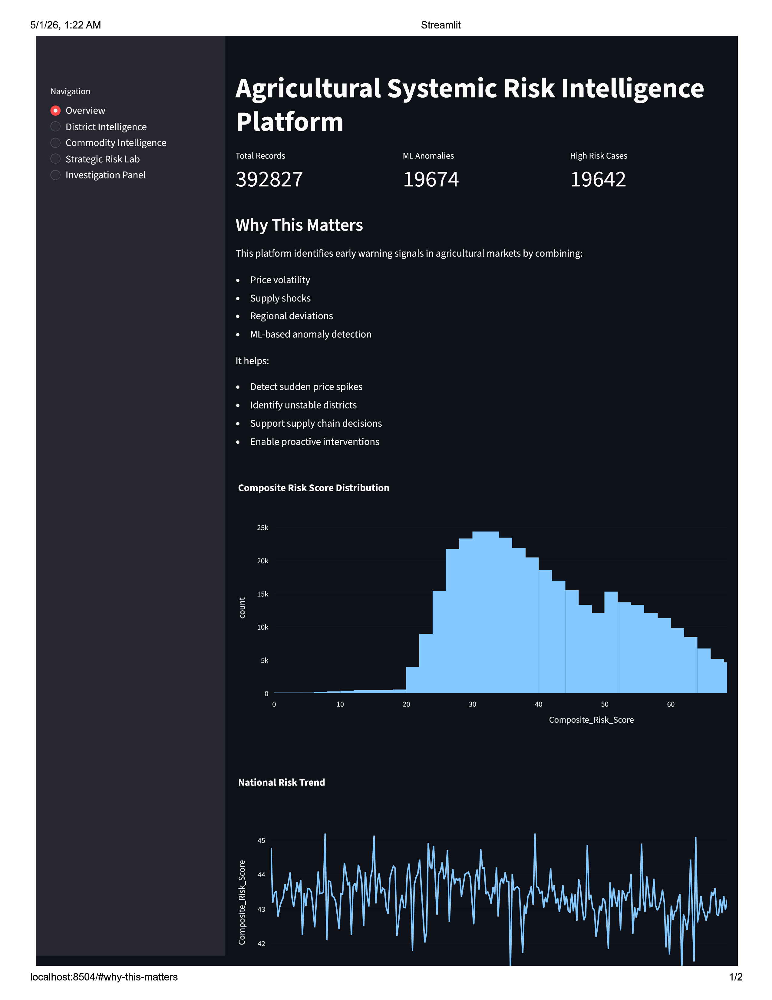
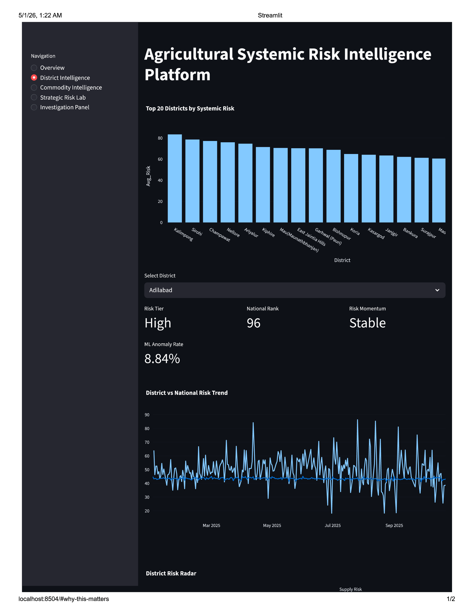
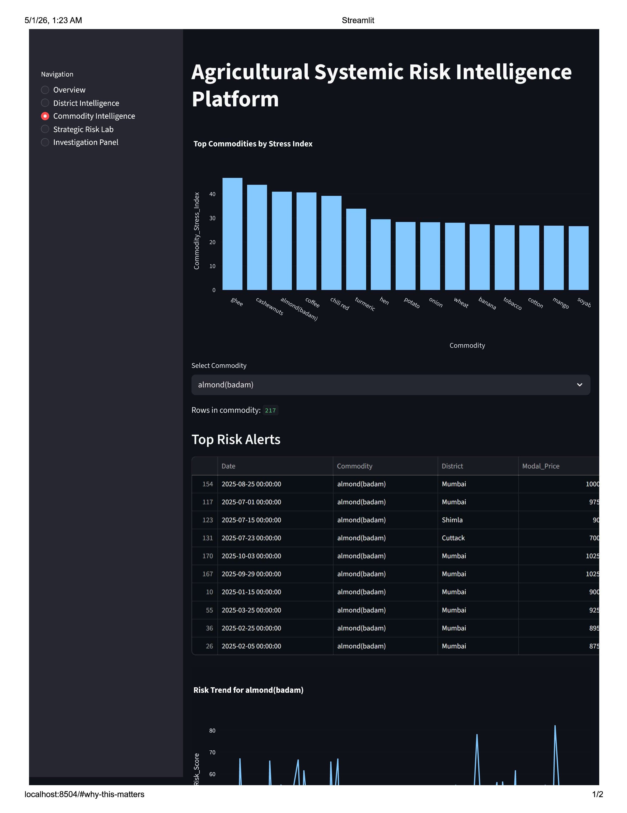

# AgriShield AI

An end-to-end data analytics system that detects early warning signals in agricultural markets using machine learning and statistical anomaly detection.

## Key Features
- Multi-source agricultural dataset (300K+ records across 24 commodities)
- Hybrid anomaly detection (Isolation Forest + Z-score)
- Composite Risk Score combining:
  - Price volatility
  - Supply-demand imbalance
  - ML anomaly signals
- District-level and commodity-level risk insights
- Interactive dashboard (Streamlit)

## Impact
- Detects abnormal price spikes early
- Identifies high-risk districts and commodities
- Helps simulate real-world supply chain instability scenarios

## Tech Stack
Python, Pandas, NumPy, Scikit-learn, Streamlit

## ML Approach
- Isolation Forest (unsupervised anomaly detection)
- Statistical Z-score thresholding
- Hybrid decision logic for robustness

## Scale
- 300,000+ records
- 24 commodities
- 1-year time series

## Workflow
1. Raw agricultural CSV ingestion
2. Data cleaning & preprocessing
3. Feature engineering
4. ML anomaly detection
5. Composite risk scoring
6. District & commodity intelligence generation
7. Interactive Streamlit dashboard

## Dashboard Modules
- Overview Dashboard
- District Intelligence
- Commodity Intelligence
- Strategic Risk Lab
- Investigation Panel

## Screenshots

### Overview Dashboard


### District Intelligence


### Commodity Intelligence



## Installation

```bash
pip install -r requirements.txt
streamlit run app.py
```

## Future Improvements
- Real-time API integration
- Predictive forecasting models
- Power BI integration
- Geo-spatial district risk mapping
